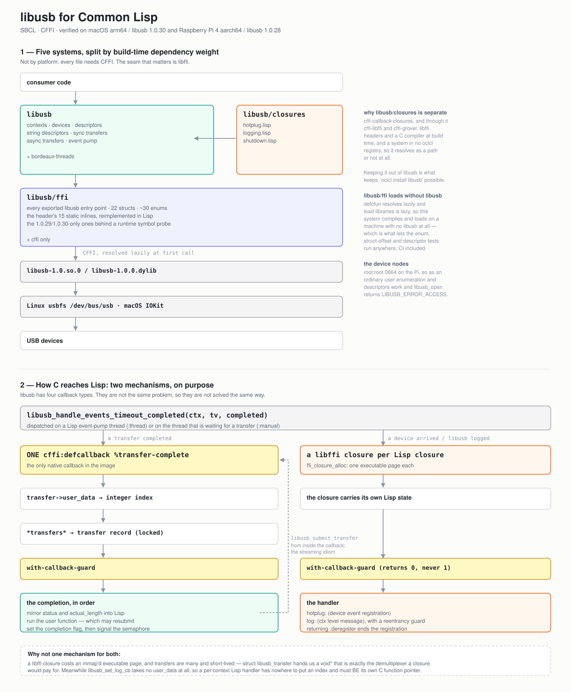

# libusb

[](https://github.com/lispnik/libusb/actions/workflows/ci.yml)

Common Lisp bindings to **libusb-1.0**: a complete raw layer over every entry point the
library exports, and an ergonomic layer over the parts anybody actually reaches for --
contexts, enumeration, descriptors, synchronous and asynchronous transfers, hotplug and
logging.

Developed on macOS arm64 against libusb 1.0.30 and verified on a Raspberry Pi 4
(aarch64) against libusb 1.0.28, which is where the hardware is.

## What it looks like

`examples/lsusb.lisp`, run under `sudo` on the Pi. This is a real transcript, not a
mock-up -- the device list, the strings, and one asynchronous bulk read that times out
because the dongle it asks is idle:

```
libusb 1.0.28.11946, hotplug supported

Bus 001 Device 022: 0451:16AE  USB 2.00, full, class :PER-INTERFACE
    Texas Instruments CC2531 USB Dongle
    interface 0 alt 0 class :VENDOR-SPEC: 83/in/bulk/64
Bus 001 Device 003: 2357:0604  USB 1.10, full, class :WIRELESS
      TP-Link Bluetooth USB Adapter (serial 3C64CF2D55A3)
    interface 0 alt 0 class :WIRELESS: 81/in/interrupt/16 02/out/bulk/64 82/in/bulk/64
    interface 1 alt 0 class :WIRELESS: 03/out/isochronous/0 83/in/isochronous/0
    interface 1 alt 1 class :WIRELESS: 03/out/isochronous/9 83/in/isochronous/9
    interface 1 alt 2 class :WIRELESS: 03/out/isochronous/17 83/in/isochronous/17
    interface 1 alt 5 class :WIRELESS: 03/out/isochronous/49 83/in/isochronous/49
Bus 001 Device 002: 2109:3431  USB 2.10, high, class :HUB
     USB2.0 Hub
    interface 0 alt 0 class :HUB: 81/in/interrupt/1

hotplug ENUMERATE: 7 arrivals for 7 devices

bulk IN 0x83, 64 bytes, 300 ms timeout: :TIMED-OUT after 0.300 s, 0 bytes
```

Those zero-sized isochronous endpoints in alternate setting 0 are not a parsing
artefact. They are how the USB specification says "this alternate setting claims no
bandwidth", and every Bluetooth adapter does it for its SCO interface -- which is worth
knowing, because a test asserting that every endpoint has a positive packet size passes
on a developer's laptop and fails the moment it meets a Bluetooth dongle. It did.

Reading it is unremarkable:

```lisp
(libusb:with-context (context)
  (libusb:with-device-list (devices :context context)
    (dolist (device devices)
      (let ((descriptor (libusb:device-descriptor device)))
        (format t "~4,'0X:~4,'0X ~(~A~)~%"
                (libusb:device-descriptor-vendor-id descriptor)
                (libusb:device-descriptor-product-id descriptor)
                (libusb:device-speed device))))))
```

Talking to something, with every acquisition released however the body ends:

```lisp
(libusb:with-open-device (handle :vendor-id #x0451 :product-id #x16ae)
  (libusb:with-claimed-interface (handle 0)
    (libusb:with-event-pump ((libusb:handle-context handle))
      ;; Asynchronous underneath, and cancellable: a Lisp deadline unwinds cleanly,
      ;; which libusb's own blocking functions cannot do once entered.
      (multiple-value-bind (data status) (libusb:bulk-in handle #x83 64 :timeout 300)
        (format t "~S: ~D byte~:P~%" status (length data))))))
```

## Systems

Split by build-time dependency weight rather than by platform -- every file here needs
CFFI, so the usual portable-core split does not apply, but a heavier seam does:

| System | Depends on | What it is |
|---|---|---|
| `libusb/ffi` | `cffi` | The raw layer: every exported libusb-1.0 entry point, 22 structs, ~30 enums, and the header's `static inline` functions reimplemented in Lisp. |
| `libusb` | `libusb/ffi`, `bordeaux-threads` | Contexts, devices, descriptors, synchronous transfers, asynchronous transfers, the event loop. |
| `libusb/closures` | `libusb`, `cffi-callback-closures` | Hotplug and log callbacks. |
| `libusb/tests` | `libusb/closures`, `fiveam` | Everything testable with no USB device. |
| `libusb/hw-tests` | `libusb/tests` | Needs a real device and permission to open it. |

`libusb/ffi` is a system of its own for two reasons. Bulk streams, `dev_mem` and the
BOS/SuperSpeed descriptor family are deliberately raw-only, so a consumer of those has
to be able to ask for the bindings without the opinions. And because `defcfun` resolves
lazily and `load-libraries` is lazy, it compiles and loads on a machine with **no libusb
installed at all** -- which is what lets the enum, struct-offset and descriptor tests run
anywhere.

`libusb/closures` is separate because `cffi-callback-closures` brings `cffi-libffi` and
`cffi-grovel` with it -- libffi headers and a C compiler at build time -- and is in no
ocicl registry, so it resolves as a filesystem path or not at all. Keeping it out of
`#:libusb` is what keeps `ocicl install libusb` possible.

## Callbacks, and why there are two mechanisms

libusb has four callback types, and this library implements them two different ways
because they are not the same problem.

**Transfer completion** uses a single `cffi:defcallback` for the whole image, with an
integer index in the transfer's own `user_data` field finding the Lisp record. There is
exactly one native callback here, and that is deliberate: a libffi closure per transfer
would cost an `ffi_closure_alloc` -- an mmap'd executable page plus a foreign `ffi_cif`
-- for an object that lives for one 300 ms bulk read, and a streaming application churns
thousands of them. `struct libusb_transfer` hands us a `void *` of our own, which is
precisely the demultiplexer a closure would otherwise be paying for.

**Hotplug and logging** use `cffi-callback-closures` to mint a C function pointer per
Lisp closure. For hotplug that is a preference; for logging it is the only way:

```c
void libusb_set_log_cb(libusb_context *ctx, libusb_log_cb cb, int mode);
typedef void (*libusb_log_cb)(libusb_context *, enum libusb_log_level, const char *);
```

No `user_data` anywhere in it. There is nowhere to put a registry index, so a per-context
Lisp handler has to *be* its own C function pointer.

Every callback body goes through one guard, and that is not a style preference. Neither
`cffi:defcallback` nor `cffi-callback-closures` contains an error: a condition signalled
inside a callback propagates out through the native dispatcher into libusb's frame --
the debugger entered while holding a libusb lock, or process death on a thread libusb
created. So each body is wrapped, reports, and returns a safe sentinel; and for hotplug
that sentinel is `0`, because `1` means "deregister me" and a handler with a bug in it
should not also disappear.

## Event handling

libusb has no thread of its own. Somebody must call `libusb_handle_events` or nothing
ever completes -- transfer timeouts are enforced inside it, hotplug callbacks are
dispatched from it, and a transfer nobody is waiting on simply never finishes. Two modes:

- **`:thread`** -- `START-EVENT-PUMP`, or `WITH-EVENT-PUMP`, runs a Lisp thread per
  context. The default for anything using hotplug, because a library whose hotplug
  callbacks silently never fire until the caller builds a pump has no hotplug feature at
  all. Completions arrive on a Lisp thread, which removes a whole class of
  foreign-thread hazard.
- **`:manual`** -- nobody pumps, and a thread waiting for a transfer does the pumping
  itself through `libusb_handle_events_timeout_completed`. Zero threads, completions on
  the caller's thread, deterministic ordering. Most of the test suite runs this way.

`libusb_get_pollfds` and `libusb_set_pollfd_notifiers` are exposed for integration into
an external epoll or select loop, and no loop is built on them here. The trap is
`libusb_pollfds_handle_timeouts`, which returns **false on macOS**: an external loop
there must also drive `libusb_get_next_timeout` and enforce transfer timeouts itself, and
if it does not, everything works until a device stops answering.

`STOP-EVENT-PUMP` joins the thread and **signals rather than giving up**, because
returning normally is a promise that `libusb_exit` is now safe. `libusb_exit` while
another thread sits inside `libusb_handle_events` is a use-after-free that presents as a
crash in `poll()` with no libusb frames on the stack.

## Conditions

One root, `LIBUSB-ERROR`; trap it to catch anything USB-related. Under it,
`LIBUSB-API-ERROR` with one subclass per `libusb_error` value, so a caller writes
`(handler-case … (libusb:libusb-busy …))` rather than comparing integers.
`LIBUSB-ACCESS-ERROR` is the one worth catching by name: on Linux it almost always means
the `/dev/bus/usb` node is not writable, which is a udev rule or a `sudo` and nothing at
all about the device. Also `LIBUSB-UNSUPPORTED-FUNCTION` for a version-guarded entry
point this libusb lacks, `LIBUSB-INVALID-OBJECT` for a closed handle,
`LIBUSB-STALE-OBJECT` for one from a previous image, and `LIBUSB-USAGE-ERROR` for a call
rejected here before it could become undefined behaviour in C.

The policy is **signal by default**, with four documented exceptions where failure is an
ordinary answer:

1. A **timeout on a transfer** returns `(values result :timeout)` and never signals.
   libusb fills in how much arrived before giving up, so a short read plus `:timeout` is
   the truth about what reached the device, and an unwind would discard it.
2. **String descriptors** return `(values nil reason)`. Devices advertise string indices
   they will not produce as a matter of course, and index 0 means "no string" rather than
   "string zero".
3. **No active configuration** is `NIL`. An unconfigured device is a state.
4. **Kernel-driver queries** answer `NIL` rather than signalling where the platform
   cannot say; detaching a driver that is not there is success by another name.

Numeric codes are also available as keywords, and the message table is for messages only
-- deliberately not `libusb_strerror`, whose text `libusb_setlocale` can translate out
from under anyone who matched on it.

## Memory, and who frees what

The ergonomic layer owns no foreign memory across a function boundary except the three
handles: context, device and device handle. Descriptors are deep-copied out of C inside
an `unwind-protect` that frees libusb's tree, so there is no `FREE-CONFIG-DESCRIPTOR` in
this API -- after `ACTIVE-CONFIG-DESCRIPTOR` returns there is nothing left to free. That
includes the class-specific `extra` blobs, which are the entire content of exactly the
devices people write bindings for.

Devices are reference-counted and released by `UNREF-DEVICE`, `WITH-DEVICE-LIST`, or
closing the context. There are **no GC finalizers**, on purpose: an `sb-ext:finalize`
calling `libusb_unref_device` can run after `libusb_exit`, which is an unrecoverable
use-after-free. A list the context owns cannot.

Asynchronous transfer buffers are `foreign-alloc`'d rather than pinned Lisp vectors, and
that is forced rather than chosen. SBCL's pinning is dynamic-extent, but an async buffer
must stay put from `libusb_submit_transfer` until a completion callback on another thread
at an unknown later time. Unpinned, a GC in any thread can move an octet vector while
the kernel is writing into its old address -- which surfaces as occasional wrong bytes,
with no crash and nothing to bisect. One `memcpy` against a USB transaction is not a
trade worth thinking about twice. `:BUFFER-POINTER` and `:DEV-MEM` are the documented
escapes.

## Testing it, without a device

Most of this library is tested on machines with no USB hardware, and not by mocking
anything. libusb calls the completion callback with one argument, a
`struct libusb_transfer *`; nothing stops the test suite calling it the same way. So the
registry, the demultiplexer, the error containment, the transfer state machine, the
minted closures and every struct offset are covered by filling a struct as the kernel
would have and invoking the real entry point through its own function pointer:

```
Running test THE-DISPATCHER-FINDS-THE-RIGHT-TRANSFER-OUT-OF-A-THOUSAND ..
Running test AN-ERROR-IN-A-USER-COMPLETION-FUNCTION-DOES-NOT-UNWIND-INTO-C .....
Running test A-LOG-HANDLER-THAT-ITSELF-LOGS-DOES-NOT-RECURSE-UNTIL-THE-STACK-IS-GONE ..
```

And for hotplug there is a lever that needs no hardware at all:
`LIBUSB_HOTPLUG_ENUMERATE` makes `libusb_hotplug_register_callback` invoke the callback
synchronously, before it returns, once per already-attached device. That exercises the
entire hotplug path -- a libffi closure minted at runtime, libusb's C call into it, the
enum translation, the device reference, the guard and the return value -- with no
privileges, nothing plugged or unplugged, and no waiting.

```sh
make test          # needs no USB device; this is what CI runs
make check         # also compile the hardware suite, which must not rot
make layout        # our struct offsets vs. the installed libusb.h, via a C compiler
```

On the Pi:

```sh
make deploy        # rsync this tree, ocicl/, and the cffi-callback-closures checkout
make pi-test       # unprivileged: 578 checks
make pi-test-root  # adds the CC2531 tier under sudo: 76 more
```

The hardware tier only ever touches the TI CC2531 dongle and, read-only, the hubs. The
Bluetooth adapters on that machine have the kernel's `btusb` driver bound and are in use,
so a `*forbidden*` list refuses them **in code** rather than by convention -- the cost of
a mistake there is somebody else's working Bluetooth. Nothing is ever reset.

FiveAM has no teardown hook, so leaks are caught by assertion: every resource is
acquired by a macro with an `unwind-protect`, a hygiene suite asserts that no context,
transfer, registration or minted closure survived the run, and the runner fails the run
if its final `SHUTDOWN-ALL` had anything left to sweep up.

## Images

Nothing survives `save-lisp-and-die` -- not the context's file descriptors, not a
malloc'd transfer, not a libffi trampoline's address, not the handle on
`libusb-1.0.so`. A dump hook tears everything down so a forgetful caller gets a clean
core, and a restore hook bumps an epoch that makes every surviving Lisp object
detectably dead: using one signals `LIBUSB-STALE-OBJECT` instead of calling into an
address that now belongs to something else. There is no honest way to replay an open
device handle across a save, so this library does not pretend to. Call `SHUTDOWN-ALL`
before dumping and `OPEN-CONTEXT` again afterwards.

## Examples

`examples/lsusb.lisp` lists the bus, with strings where it has permission to open a
device, and fires a hotplug `ENUMERATE` pass.

The CC2531 sniffer that used to be here is now its own project,
[lispnik/zigbee-sniffer](https://github.com/lispnik/zigbee-sniffer): a command-line tool
that captures to the terminal, to pcap for Wireshark, or live down a pipe, and surveys
channels. It exercises what nothing in this repository does -- eight bulk transfers in
flight at once, each resubmitted from its own completion callback, which is the
streaming idiom the transfer registry exists for.

## Architecture

`docs/architecture.svg` draws both halves of it: the five systems and where the libffi
dependency sits, and the two routes by which C reaches Lisp. It is generated by
`docs/architecture.py`, so the layout arithmetic is checked by a machine rather than by
eye.



## Layout

```
src/package.lisp        the #:libusb package; raw-layer exports
src/library.lisp        finding and lazily opening libusb-1.0
src/conditions.lisp     the condition hierarchy and CHECK-RESULT
src/enums.lisp          ~30 enums and bitfields, and tolerant translation
src/structs.lisp        22 foreign structs, hand-written
src/ffi.lisp            every exported libusb entry point
src/ffi-optional.lisp   the 1.0.29/1.0.30-only ones, behind a runtime probe
src/inline.lisp         the header's static inlines, reimplemented in Lisp
src/api-package.lisp    ergonomic-layer exports
src/core.lisp           contexts, and the teardown order
src/descriptors.lisp    descriptors as Lisp values; deep copy out of C
src/device.lisp         enumeration and topology
src/handle.lisp         opening, claiming, kernel drivers
src/strings.lisp        string descriptors, where failure is routine
src/transfers-sync.lisp libusb's blocking transfers, and buffer marshalling
src/guard.lisp          WITH-CALLBACK-GUARD: the error barrier every callback needs
src/transfer.lisp       the registry, the one native callback, the state machine
src/events.lisp         the event pump and libusb's polling primitives
src/with.lisp           the remaining WITH- macros and the async conveniences
src/closures-package.lisp
src/hotplug.lisp        hotplug, as a minted libffi closure
src/logging.lisp        log callbacks, which have no user_data and so must be closures
src/shutdown.lisp       SHUTDOWN-ALL, and the image dump/restore hooks
```

## Requirements

SBCL, and libusb-1.0 at run time. `libusb/closures` additionally needs libffi headers
and a C compiler at build time, by way of `cffi-callback-closures` -- which is not in any
ocicl registry and so must be a checkout on the ASDF source registry; the `Makefile`
takes `CCC_DIR` for it and `make deploy` ships it to the Pi.

Version-guarded entry points (`libusb_get_device_string`, `libusb_get_session_data` and
the 1.0.29 raw-I/O trio) are probed with `cffi:foreign-symbol-pointer` at call time
rather than gated on a read-time feature, because which libusb we are loaded against is
a run-time fact: the same fasl runs against 1.0.30 on a laptop and 1.0.28 on a
Raspberry Pi.

## License

MIT. See `LICENSE`.
